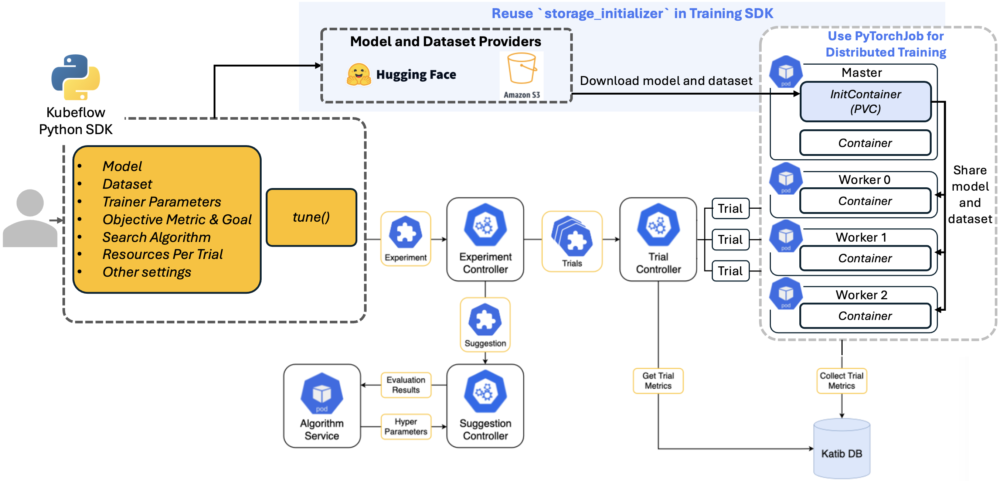

This summer, I had the opportunity to participate in the Google Summer of Code (GSoC) program, where I contributed to Kubeflow, an open-source machine learning toolkit. My project focused on developing a high-level API for optimizing hyperparameters in Large Language Models (LLMs) within Katib, Kubeflow's automated hyperparameter tuning system. I'd like to share insights from this experience with others interested in Kubeflow, GSoC, or optimizing LLMs.

## Motivation

The rapid advancements and rising popularity of LLMs, such as GPT and BERT, have created a growing demand for efficient LLMOps in Kubernetes. To address this, we have developed a [train API](https://www.kubeflow.org/docs/components/training/user-guides/fine-tuning/) within the Training Python SDK, simplifying the process of fine-tuning LLMs using distributed PyTorchJob workers. However, hyperparameter optimization remains a crucial yet labor-intensive task for enhancing model performance.

## Goal

Hyperparameter optimization is a crucial but time-consuming task in fine-tuning machine learning models, especially for LLMs that involve billions of parameters. This API aims to streamline this process by abstracting the complexity of Kubernetes infrastructure, enabling data scientists to focus on model performance instead of system configuration.

## My Contributions to the GSoC Project

My work on the project can be broadly divided into four stages:

- **Stage 1**: Writing the project proposal and converting it into a Kubeflow Enhancement Proposal (KEP).
- **Stage 2**: Developing and implementing the high-level API.
- **Stage 3**: Implementing unit tests and end-to-end tests for the API.
- **Stage 4**: Creating documentation and presenting the work to the Kubeflow community.

In addition, I addressed several critical bugs in previous Katib and Training Operator releases and contributed new features, such as writing end-to-end tests for the train API.

For those interested, here is a [detailed summary](https://github.com/kubeflow/katib/issues/2339) of all the pull requests I submitted during this process.

## My Learning Journey

This is my first experience with open source, and I gained extensive technical knowledge throughout this project, including Docker, Kubernetes, and Kubeflow itself. Before developing and implementing the API, I invested significant time onboarding and familiarizing myself with Kubeflow. The [official documentation](https://www.kubeflow.org/docs/) and [GitHub repository](https://github.com/kubeflow) were invaluable resources during this process.

Beyond these technical skills, I also learned several key lessons that extend into broader personal and professional growth:

### Think from the User's Perspective

One key lesson was the importance of considering the user’s needs. Discussing API design with my mentors taught me to focus on what functionalities users need and how they prefer to use them. Listening to users’ feedback is crucial for effective product design.

### Don't Fear Bugs

I used to feel overwhelmed by bugs and unsure how to tackle them. When a bug caused a container failure during a Katib trial, my mentor guided me through the debugging process, teaching me how to systematically trace and understand the issue. The key is to approach debugging methodically and think through each step of the problem.

### Communication is Important

Communication is important in collaboration, especially in open source projects. There are various ways of communicating in open-source projects, such as GitHub issues or PRs, Slack, and community meetings. And I’m grateful to my mentor for discussing my challenges during weekly meeting and providing invaluable guidance.

## Every Contribution Counts

Initially, I thought contributing to open source was complex. I learned that every contribution, no matter how small, is valuable and appreciated. For example, contributing to documentation is crucial, especially for newcomers.

## In The End

I am deeply grateful to everyone who supported me throughout this project. Your suggestions, advice, and encouragement were invaluable in helping me complete my work.

I especially want to extend my heartfelt thanks to my mentor, Andrey Velichkevich. His deep knowledge of both the project and the industry, combined with his willingness to help, has been incredibly inspiring. I greatly appreciate the time and effort he dedicated to guiding me, from the high-level design of the API to the finer details like code formatting. I have learned so much from his mentorship.

Looking ahead, I am excited to continue contributing to Kubeflow. I also look forward to helping future contributors by improving documentation and sharing my experiences with newcomers in the community.
