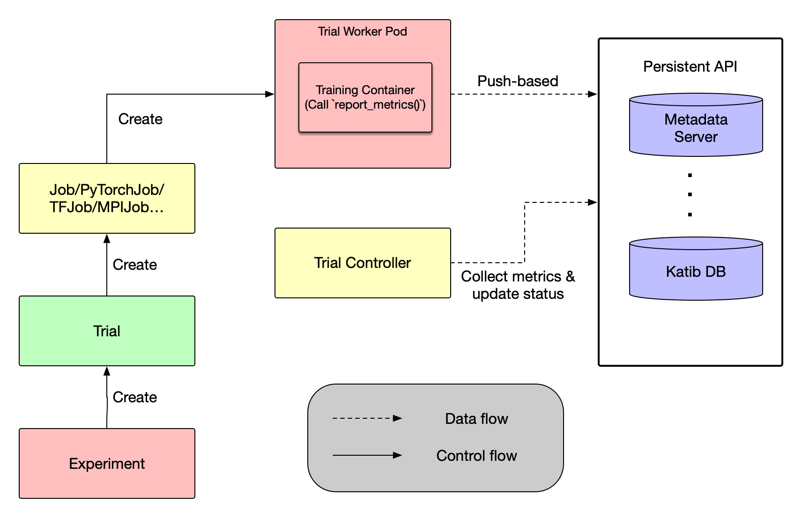

This summer, I gained a precious opportunity to participate in the Google Summer of Code(GSoC), in which I would contribute to Katib and fulfill a project named ["Push-based Metrics Collection in Katib"](https://www.kubeflow.org/events/gsoc-2024/#project-6-push-based-metrics-collection-for-katib) within 12 weeks. 
Firstly, I got to know about GSoC and Kubeflow with the recommendation from the former active maintainer Ce Gao(gaocegege)'s personal blog. And deeply impressed by the idea of cloud native AI toolkits, I decided to have a dip into this area and learn some skills to enhance my competence for career life in the future.
In the blog, I'll provide my personal insight into Katib, for those who are interested in cloud native, AI, and hyperparameters tuning.

## Goal

The project aims to provide a Python SDK API interface for users to push metrics to Katib DB directly.

The current implementation of Metrics Collector is pull-based, raising design problems such as determining the frequency at which we scrape the metrics, performance issues like the overhead caused by too many sidecar containers, and restrictions on developing environments that must support sidecar containers and admission webhooks. And also, for data scientists, they need to pay attention to the format of metrics printed in the training scripts, which is error prone and may be hard to recognize.

Thus, we decided to implement a new API for Katib Python SDK to offer users a push-based way to store metrics directly into the Kaitb DB and resolve those issues raised by pull-based metrics collection.

## What I did in GSoC Project

I raised numerous PRs for the Katib and Training-Operator project. Some of them are related to my GSoC project, and others may contribute to the completeness of UTs, simplicity of dependency package, and the compatibility of UI component, etc.

For reference, the coding period can be rougly divided into 3 stages:

1. Convert the proposal to KEP and discuss with mentors about the architecture, API design, etc. (~4 weeks)

2. Develop push-based metrics collection interface according to the KEP. (~8 weeks)

3. Write some examples and documentations & Present my work to Kubeflow Community. 

Also, I raised some issues not only to describe the problems and bugs I met during the coding period, but also to suggest the future enhancement direction for Katib and Training-Operator.

There is an [Github Issue](https://github.com/kubeflow/katib/issues/2340) tracks the progress of developing push-based metrics collection for katib during the GSoC coding phase. If interested in my work or Katib, you can check this issue for more details.

## Lessons I Learned during the Project

1. **Think Twice, Code Once**: Andrey taught me that we should think of the API specification and all the related details before coding. This can significantly reduce the workload of the coding period and avoid big refactor of the project. Meanwhile, my understanding of Katib got clear gradually during the over-and-over rounds of re-think and re-design of the architecture.

2. **Dive into the Source Code**: Engineering projects nowadays are extremely complex and need much effort to understand them. The best way to get familiar with the project is to dive into the source code and run several examples.

3. **Communication**: Communication is the most important thing when we collaborate with others. Expressing your idea precisely and making others understand you easily are significant skills not only in open source community but also in various scenes such as company and group works.

## In the End

Special Thanks:

1. To my mentors [@andreyvelich](https://github.com/andreyvelich) [@johnugeorge](https://github.com/johnugeorge) [@tenzen-y](https://github.com/tenzen-y), especially to Andrey. Your great knowledge about the code base and the industry impressed me a lot. Thanks for your timely response to my PRs and for always attending the weekly meetings to solve my pending problems, from which I benefited a lot. What's more, I can well remember that, in that night, you explained the usage of Kubeflow in the industry to me with greate patience, and encouraged me not to doubt about myself, just do it and explore more, contribute more. You ignite the flame of my desire to contribute to cloud native AI.

2. To [@gaocegege](https://github.com/gaocegege). You recommend me to the Kubeflow Community. Thanks for your patient answers for my endless silly questions.

3. To Google. Thanks for offering such a precious opportunity for me to begin my journey in the open source world!

I hold a firm belief that every small step counts, and everybody in the community is unique and of great significance. There is no doubt that our joint efforts will surely contribute to the flourishing of our Kubeflow Community, make it the world-best community managing AI lifecycle on Kubernetes, and attract much more attention from the industry. Then, more and more new comers will pour in and work along with us.

Again, I'll continue to contribute to Kubeflow.