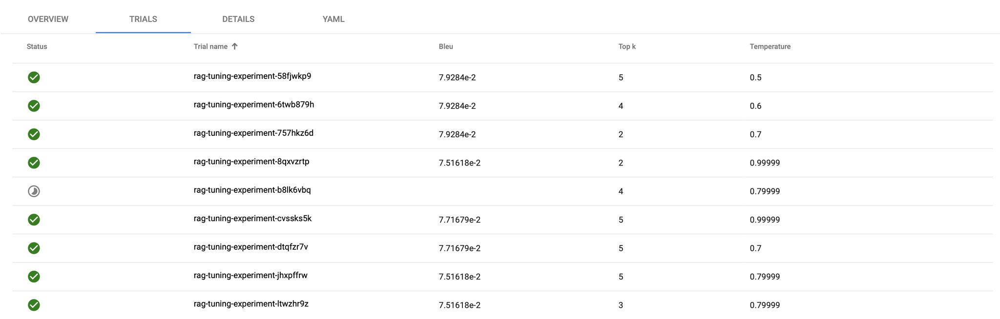
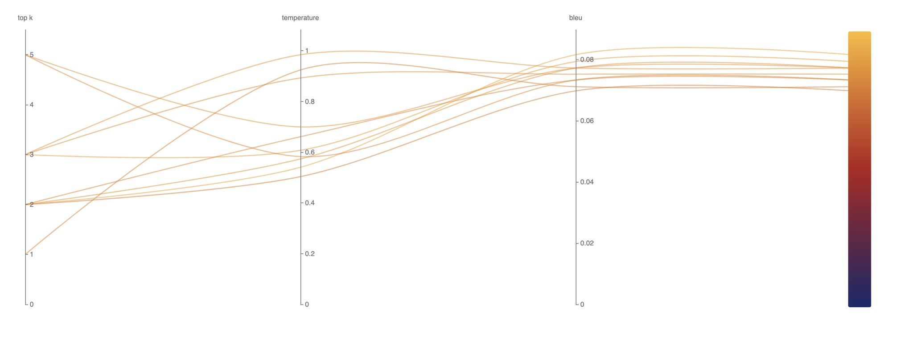

# Introduction

As artificial intelligence and machine learning models become more
sophisticated, optimising their performance remains a critical challenge.
Kubeflow provides a robust component, [KATIB][Katib], designed for
hyperparameter optimization and neural architecture search. As a part of the
Kubeflow ecosystem, KATIB enables scalable, automated tuning of underlying
machine learning models, reducing the manual effort required for parameter
selection while improving model performance across diverse ML workflows.

With Retrieval-Augmented Generation ([RAG][rag]) becoming an increasingly
popular approach for improving search and retrieval quality, optimizing its
parameters is essential to achieving high-quality results. RAG pipelines involve
multiple hyperparameters that influence retrieval accuracy, hallucination
reduction, and language generation quality. In this blog, we will explore how
KATIB can be leveraged to fine-tune a RAG pipeline, ensuring optimal performance
by systematically adjusting key hyperparameters.

# Let's Get Started!

## STEP 1: Setup

Since compute resources are scarcer than a perfectly labeled dataset :), we’ll
use a lightweight [Kind cluster (Kubernetes in Docker)][kind_documentation]
cluster to run this example locally. Rest assured, this setup can seamlessly
scale to larger clusters by increasing the dataset size and the number of
hyperparameters to tune.

To get started, we'll first install the KATIB controller in our cluster by
following the steps outlined [in the documentation][katib_installation].

## STEP 2: Implementing RAG pipeline

In this implementation, we use a [retriever model][retriever_model_paper], which
encodes queries and documents into vector representations to find the most
relevant matches, to fetch relevant documents based on a query and a generator
model to produce coherent text responses.

### Implementation Details:

1. Retriever: Sentence Transformer & FAISS Index
   - A SentenceTransformer model (paraphrase-MiniLM-L6-v2) encodes predefined
     documents into vector representations.
   - [FAISS][FAISS] is used to index these document embeddings and perform
     efficient similarity searches to retrieve the most relevant documents.
2. Generator: Pre-trained GPT-2 Model
   - A Hugging Face GPT-2 text generation pipeline (which can be replaced with
     any other model) is used to generate responses based on the retrieved
     documents. I chose GPT-2 for this example as it is lightweight enough to
     run on my local machine while still generating coherent responses.
3. Query Processing & Response Generation
   - When a query is submitted, the retriever encodes it and searches the FAISS
     index for the top-k most similar documents.
   - These retrieved documents are concatenated to form the input context, which
     is then passed to the GPT-2 model to generate a response.
4. Evaluation: [BLEU][bleu] (Bilingual Evaluation Understudy) Score Calculation
   - To assess the quality of generated responses, we use the BLEU score, a
     popular metric for evaluating text generation.
   - The evaluate function takes a query, retrieves documents, generates a
     response, and compares it against a ground-truth reference to compute a
     BLEU score with smoothing functions from the nltk library.

Below is the script implementing this RAG pipeline:

```python
from sentence_transformers import SentenceTransformer
from transformers import pipeline
import numpy as np
import faiss

# Retriever: Pre-trained SentenceTransformer
retriever_model = SentenceTransformer('paraphrase-MiniLM-L6-v2')

documents = fetch_documents()
doc_embeddings = retriever_model.encode(documents)

# Build FAISS index
index = faiss.IndexFlatL2(doc_embeddings.shape[1])
index.add(np.array(doc_embeddings))

# Generator: Pre-trained GPT-2
generator = pipeline("text-generation", model="gpt2", tokenizer="gpt2")


def rag_pipeline_execute(query, top_k=1, temperature=1.0):
   query_embedding = retriever_model.encode([query])
   distances, indices = index.search(query_embedding, top_k)
   retrieved_docs = [documents[i] for i in indices[0]]

   context = " ".join(retrieved_docs)
   generated = generator(context, max_length=50, temperature=temperature, num_return_sequences=1)
   return generated[0]['generated_text']


def fetch_documents():
   return [
      # Retun the list of documents...
   ]
```

#### Evaluating the Pipeline - BLEU Score Calculation

The `evaluate` function measures the quality of generated text using the BLEU
score. This function runs the RAG pipeline for a given query, compares the
output against a reference answer, and computes the BLEU score with smoothing
techniques.

```python
import argparse
from nltk.translate.bleu_score import sentence_bleu, SmoothingFunction
from rag import rag_pipeline_execute


# Simulated RAG pipeline (simplified for example)
def rag_pipeline(query, top_k, temperature):
   return rag_pipeline_execute(query, top_k=top_k, temperature=temperature)


# Evaluate BLEU score
def evaluate(query, ground_truth, top_k, temperature):
   # Get the RAG pipeline response
   response = rag_pipeline(query, top_k, temperature)

   # Tokenize the response and ground truth
   reference = [ground_truth.split()]  # Reference should be a list of tokens
   candidate = response.split()  # Candidate is the generated response tokens

   # Apply smoothing to the BLEU score
   smoothie = SmoothingFunction().method1  # Use method1 for smoothing
   bleu_score = sentence_bleu(reference, candidate, smoothing_function=smoothie)

   return bleu_score


if __name__ == "__main__":
   # Parse command-line arguments
   parser = argparse.ArgumentParser(description="Evaluate BLEU score for a query using RAG pipeline")
   parser.add_argument("--top_k", type=int, required=True, help="Number of top documents to retrieve")
   parser.add_argument("--temperature", type=float, required=True, help="Temperature for the generator")
   args = parser.parse_args()

   # TODO: The queries and ground truth against which the BLEU score needs to be evaluated. 
   #  They can be provided in the script below or loaded from an external volume.
   query = ""
   ground_truth = " "

   # Call evaluate with arguments from the command line
   bleu_score = evaluate(query, ground_truth, args.top_k, args.temperature)
   print(f"BLEU={bleu_score}")
```

_Note_: Make sure to return the result in the format of `<parameter>=<value>`
for Katib's metrics collector to be able to utilize it. More ways to configure
the output are available in [Kubeflow Metrics
Collector][Katib_metrics_collector] guide.

The above scripts will be used to build our `rag-pipeline` image, that will be
specified in the `Experiment`.

## STEP 3: Run a KATIB Experiment

To optimize the RAG pipeline’s hyperparameters, let's define an `Experiment` CR.
An experiment will define a single optimization run. More details on this API is
available in the [documentation][katib_api].

```yaml
apiVersion: "kubeflow.org/v1beta1"
kind: Experiment
metadata:
  name: rag-tuning-experiment
  namespace: kubeflow
spec:
  objective:
    type: maximize # Ensures that Katib tries to maximize the BLEU score.
    goal: 0.8 # Sets the desired BLEU score threshold.
    objectiveMetricName: BLEU # This should match with what we have provided in the script.
  algorithm:
    algorithmName: grid
  parameters:
    - name: top_k # Controls the number of retrieved documents.
      parameterType: int
      feasibleSpace:
        min: "1"
        max: "5"
        step: "1" # Adding a step for discrete search
    - name: temperature # Influences randomness in text generation.
      parameterType: double
      feasibleSpace:
        min: "0.5"
        max: "1.0"
        step: "0.1" # Adding a step for temperature
  metricsCollectorSpec: # Specifies how Katib collects experiment results.
    collector:
      kind: StdOut # Tells Katib to extract metrics from standard output logs.
  trialTemplate:
    primaryContainerName: training-container
    trialParameters: # Map hyperparameters (top_k and temperature) to their respective references in the job spec.
      - name: top_k
        description: Number of top documents to retrieve
        reference: top_k
      - name: temperature
        description: Temperature for text generation
        reference: temperature
    trialSpec:
      apiVersion: batch/v1
      kind: Job
      spec:
        template:
          spec:
            containers:
              - name: training-container
                image: rag-pipeline:latest
                command:
                  - "python"
                  - "/app/optimization-script.py"
                  - "--top_k=${trialParameters.top_k}"
                  - "--temperature=${trialParameters.temperature}"
                resources:
                  limits:
                    cpu: "1"
                    memory: "2Gi"
            restartPolicy: Never
```

After applying this yaml on the cluster, we can see our optimization script in
action.

```commandline
kubectl get experiments.kubeflow.org -n kubeflow
NAME                    TYPE      STATUS   AGE
rag-tuning-experiment   Running   True     10m
```

We can also see the trials being run to search for the optimized parameter:

```commandline
kubectl get trials --all-namespaces
NAMESPACE   NAME                             TYPE      STATUS   AGE
kubeflow    rag-tuning-experiment-7wskq9b9   Running   True     10m
kubeflow    rag-tuning-experiment-cll6bt4z   Running   True     10m
kubeflow    rag-tuning-experiment-hzxrzq2t   Running   True     10m
```

The list of completed trials and their results will be shown in the UI like
below. Steps to access Katib UI are available [in the documentation][katib_ui]:




# Conclusion

In this experiment, we leveraged Kubeflow Katib to optimize a
Retrieval-Augmented Generation (RAG) pipeline, systematically tuning key
hyperparameters like top_k and temperature to enhance retrieval precision and
generative response quality.

For anyone working with RAG systems or hyperparameter optimization, Katib is a
powerful tool—enabling scalable, efficient, and intelligent tuning of machine
learning models! We hope this tutorial helps you streamline hyperparameter
tuning and unlock new efficiencies in your ML workflows!

[Katib]: https://www.kubeflow.org/docs/components/katib/
[kind_documentation]: https://kind.sigs.k8s.io/
[rag]: https://en.wikipedia.org/wiki/Retrieval-augmented_generation
[katib_installation]: https://www.kubeflow.org/docs/components/katib/installation/
[retriever_model_paper]: https://www.sciencedirect.com/topics/computer-science/retrieval-model
[FAISS]: https://ai.meta.com/tools/faiss/
[bleu]: https://huggingface.co/spaces/evaluate-metric/bleu
[Katib_metrics_collector]: https://www.kubeflow.org/docs/components/katib/user-guides/metrics-collector/#pull-based-metrics-collector
[katib_api]: https://www.kubeflow.org/docs/components/katib/reference/architecture/#experiment
[katib_ui]: https://www.kubeflow.org/docs/components/katib/user-guides/katib-ui/
