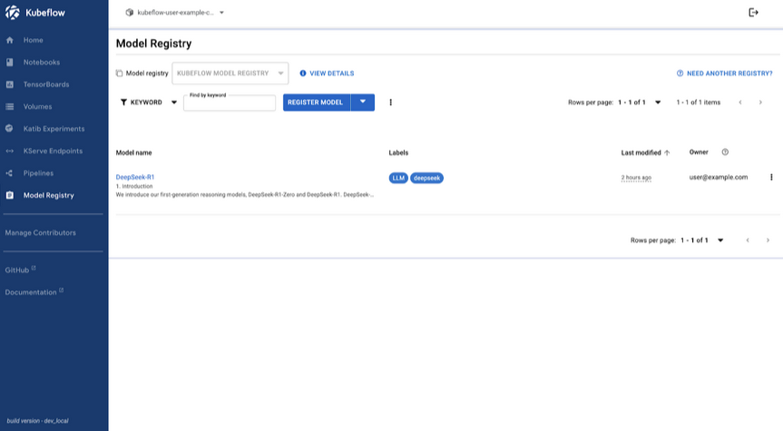

Kubeflow 1.10.0 delivers essential updates that enhance the flexibility, efficiency, and scalability of machine learning
workflows. The new features span across several components, improving both user experience and system performance.

## Highlight features

* Trainer 2.0
* New UI for Model Registry
* Spark Operator as a core Kubeflow component
* Kubernetes and container security (CISO compatibility)
* Hyperparameter Optimization for LLMs Fine-Tuning
* Loop parallelism in Pipelines
* New parameter distributions for Katib
* Deeper Model Registry integrations with KServe
* New Python SDK, OCI storage, and model caching for KServe
* New security contexts and rootless Istio-CNI integrations for Spark Operator

## Kubeflow Platform (Manifests & Security)

The Kubeflow Platform Working Group focuses on simplifying Kubeflow installation, operations, and security. See details below.

### Manifests:

* Spark Operator 2.1.0 included in Kubeflow platform, although not installed yet by default
* [Documentation updates](https://github.com/kubeflow/manifests/blob/master/README.md) that make it easier to install,
  extend and upgrade Kubeflow
* For more details and future plans please consult the [1.10.0](https://github.com/kubeflow/manifests/issues/2763) and
  [1.10.1/1.11.0](https://github.com/kubeflow/manifests/issues/3038) milestones

| Notebooks | Dashboard | Pipelines | Katib | Trainer | KServe | Model Registry | Spark |
|:---------:|:---------:|:---------:|:-----:|:-------:|:------:|:--------------:|:-----:|
| [1.10](https://github.com/kubeflow/kubeflow/issues/7459)      | [1.10](https://github.com/kubeflow/kubeflow/tags)      | [2.4.1](https://github.com/kubeflow/pipelines/releases)     | [0.18](https://github.com/kubeflow/katib/releases)  | [1.9](https://github.com/kubeflow/trainer/releases)     | [0.14](https://github.com/kserve/kserve/releases)   | [0.2.15](https://github.com/kubeflow/model-registry/releases)         | [2.1.0](https://github.com/kubeflow/spark-operator/releases/tag/v2.1.0) |

| Kubernetes | Kind | Kustomize | Cert Manager | Knative | Istio | Dex  | Oauth2-proxy |
|:----------:|:----:|:---------:|:------------:|:-------:|:-----:|:----:|:------------:|
| 1.31-1.33  | 0.26 | 5.4.3     | 1.16.1       | 1.16    | 1.24  | 2.41 | 7.7          |

### Security:

* CVE reductions - regular scanning with trivy
* Kubernetes and container security best practices:
    * [Rootless containers](https://github.com/kubeflow/manifests/issues/2528) / PodSecurityStandards restricted for:
      Istio-CNI, Knative, Dex, Oauth2-proxy, Spark
    * [50 % done](https://github.com/kubeflow/manifests/pull/3050): KFP, Notebooks / Workspaces, Katib, Trainer, Kserve, …
    * Istio-CNI as default for rootless Kubeflow postponed to [1.10.1](https://github.com/kubeflow/manifests/milestone/2)
* OIDC-authservice has been replaced by oauth2-proxy
* [Oauth2-proxy](https://github.com/kubeflow/manifests#oauth2-proxy) and [Dex](https://github.com/kubeflow/manifests#dex)
  documentation for external OIDC authentication (Keycloak, and OIDC providers such as Azure, Google etc.)

Trivy CVE scans March 25 2025:

|     Working Group      | Images | Critical CVE | High CVE | Medium CVE | Low CVE |
|:----------------------:|:------:|:------------:|:--------:|:----------:|:-------:|
|         Katib          |   17   |      11      |   101    |    417     |   734   |
|       Pipelines        |   15   |      57      |   490    |    4030    |   1922  |
| Workbenches(Notebooks) |   12   |      12      |    59    |    179     |   224   |
|         Kserve         |   16   |      21      |   305    |    6803    |   1588  |
|       Manifests        |   14   |      8       |    4     |     94     |    52   |
|        Trainer         |   1    |      0       |    0     |     1      |    0    |
|     Model Registry     |   6    |      1       |    13    |    153     |   188   |
|         Spark          |   1    |      5       |    37    |    1640    |   141   |
|       All Images       |   81   |     115      |   1009   |   13275    |   4804  |

## Pipelines

### Support for Placeholders in Resource Limits

Kubeflow Pipelines 2.4.1 introduces support for [placeholders in resource limits](https://github.com/kubeflow/pipelines/pull/11501),
enhancing flexibility in pipeline execution.This update allows users to define dynamic resource limits using
parameterized values, enabling more adaptable and reusable pipeline definitions.

### Support for Loop Parallelism

Kubeflow Pipelines 2.4.1 introduces a new [Parallelism Limit for `ParallelFor` tasks](https://github.com/kubeflow/pipelines/issues/8718),
giving users the ability to run massively parallel inference pipelines, with more control over parallel execution in
their workflows. This feature allows users to specify the maximum number of parallel iterations, preventing resource
overutilization and improving system stability. When running large pipelines with GPUs, proper use of this feature could
save your team thousands of dollars in compute expenses.

### Implement SubDAG Output Resolution

Kubeflow 1.10 ensures that [pipelines using nested DAGs](https://github.com/kubeflow/pipelines/pull/11196) work
correctly and reliably when treated as components. Outputs from deeply nested DAGs will now resolve properly, avoiding
broken dependencies.

## Model Registry

Model Registry introduces a new user interface and enhanced model management capabilities.

### Model Registry UI

The new Kubeflow [Model Registry UI](https://www.kubeflow.org/docs/components/model-registry/getting-started/#using-the-model-registry-ui)
provides a user-friendly web interface for managing machine learning models within the Kubeflow platform. It centralizes
model metadata, version tracking, and artifact management, streamlining MLOps workflows.

Key features include:

* Easy model registration with custom metadata
* Comprehensive model management with filtering and sorting
* Archiving capabilities
* Version control
* Metadata editing

The UI interacts with the Model Registry's REST API, making it accessible to users of all technical backgrounds and
enhancing collaboration across data science, ML engineering, and MLOps teams.

To get started with the Model Registry UI, which is currently in Alpha, you can follow the instructions
[here](https://www.kubeflow.org/docs/components/model-registry/installation/#installing-on-kubeflow-platform).

The Kubeflow Model Registry UI Team would like to conduct user research to identify possible enhancements we can contribute in future iterations of the Kubeflow Model Registry UI. If you are interested in participating in this study, please fill out [this survey](https://docs.google.com/forms/d/e/1FAIpQLSeCveL-b0NyUohYa86I3VeTXeynEQLpV5Loj-1HkoUVDwlVCQ/viewform).
### Custom Storage Initializer

The Model Registry Custom Storage Initializer (CSI) is a custom implementation of the KServe ClusterStorageContainer.
This feature allows users to utilize Model Registry metadata to download and deploy models efficiently. With the newest
release of the Model Registry, it is now possible to install and use the Custom Storage Initializer (CSI).

You can find detailed installation instructions and a small example in the "Getting Started" section of the Model
Registry component on the Kubeflow website.

For additional information and future developments towards better integration with KServe, you can refer to the slides
[here](https://docs.google.com/presentation/d/1wprxN0n23EMkPRX_PaZZcIzZbn_i8Sh_).

## Training Operator (Trainer) & Katib

Kubeflow 1.10 enhances the Training Operator and Katib, providing new tools and APIs for hyperparameter optimization,
particularly for large language models.

Moreover, the Kubeflow Training Operator now supports [JAX for distributed training](https://github.com/kubeflow/trainer/issues/1619),
enabling users to leverage JAX's capabilities for efficient and scalable model training.

Finally, if you want to get involved with Trainer V2, take a look at this [KEP](https://github.com/kubeflow/trainer/tree/master/docs/proposals/2170-kubeflow-trainer-v2)
and [issue](https://github.com/kubeflow/trainer/issues/2170).

### Hyperparameter Optimization API for LLMs

Katib introduces a new high-level [API for hyperparameter tuning](https://github.com/kubeflow/katib/issues/2339),
streamlining LLMOps workflows in Kubernetes. This API integrates Katib and the Training Operator to automate
hyperparameter optimization, reducing manual effort for data scientists fine-tuning large language models. For more
information, refer to the [feature release blog post](https://blog.kubeflow.org/gsoc-2024-project-4/).

### Support for Various Parameter Distributions

Katib now adds [support for multiple probability distributions](https://github.com/kubeflow/katib/issues/2374).
Previously limited to uniform distributions, Katib now supports log-uniform, normal, and log-normal distributions,
providing data scientists with greater [flexibility in tuning hyperparameters](https://youtu.be/4myE0DPp6Ko). This is
particularly useful for parameters like learning rates, which benefit from log-uniform sampling, or values expected to
vary around a mean, suited for normal distributions.

### Push-Based Metrics Collection

Katib now allows users to push metrics to Katib DB directly. The new push-based design provides administrative and
performanace improvements to the existing pull based design. For further details, please refer to the
[Push-Based Metrics Collection blog post](https://blog.kubeflow.org/gsoc-2024-project-6/).

## Dashboard & Notebooks

Kubeflow 1.10 improves the observability and usability of Notebooks, while providing updated
[default images](https://github.com/kubeflow/kubeflow/pull/7687).

### Prometheus Metrics for Notebooks

Both the Notebooks component and CRUD backends now feature Prometheus metrics. Notebooks expose custom metrics using the
prom-client library, and CRUD backends utilize the prometheus_flask_exporter library. This ensures consistent metrics
integration across all backend services.

### More Descriptive Error Messages

Error messages for notebook creation failures due to resource constraints are now more descriptive. Users can quickly
identify issues such as insufficient resources.

## Spark Operator

The Spark Operator, now integrated as a core Kubeflow component, includes several key enhancements focusing on
architecture, security, and [performance](https://blog.kubeflow.org/operators/benchmarking/performance/2025/03/15/kubeflow-spark-operator-benchmarks.html):

* Rebuilt with Controller Runtime (v2.0.0): Modernized core architecture using controller-runtime, aligning with
  Kubernetes controller patterns for improved structure, extensibility, and testability.
* YuniKorn Gang Scheduling Support (v2.0.0): Enables efficient scheduling of Spark driver & executor pods as a group,
  ideal for large-scale data pipelines with resource guarantees.
* Enhanced Security Contexts & SeccompProfile Support (v2.1.1): Adds support for `seccompProfile: RuntimeDefault` & 
  `readOnlyRootFilesystem`, aligning with Kubernetes Pod Security Standards and minimizing security risk.

## KServe

KServe v0.14.1 introduces several essential features that enhance its capabilities for deploying and managing machine
learning models.

### New Python SDK

The release includes a new Python SDK with both REST and GRPC inference clients, offering asynchronous support and the
ability to handle tensor data in binary format.

### OCI Storage for Models

OCI storage for models has also been promoted to a stable feature, with improvements to stability by configuring OCI
models as init containers.

### Model Cache Feature

Additionally, the introduction of the Model Cache feature leverages local node storage to reduce model load times,
especially for large models, enhancing scalability.

### Hugging Face Integration

KServe v0.14.1 further expands integration with Hugging Face, enabling direct model deployment from the Hugbing Face hub
via a new `hf://` URI schema.

## What comes next?

If you want to take a peek into the Kubeflow 1.11 roadmap planning and contribute with your ideas, see
[Notebooks](https://github.com/kubeflow/kubeflow/issues/7459),
[Manifests & Security](https://github.com/kubeflow/manifests/milestone/2), Pipelines, Model Registry, Katib,
Training Operator.

## How to get started with 1.10

Visit the Kubeflow 1.10 [release page](https://github.com/kubeflow/manifests/releases) or head over to the Getting
Started and Support pages.

## Join the Community

We would like to thank everyone for the contribution to Kubeflow 1.10, especially Ricardo Martinelli De Oliveira for his
work as the v1.10 Release Manager, all the release team and the working group leads, who relentlessly dedicate their
time to this great project.

Release team members : Ricardo Martinelli De Oliveira, Dimitris Poulopoulos, Matteo Mortari, Julius von Kohout
Valentina Rodriguez Sosa, Helber Belmiro, Vraj Bhatt, Diego Lovison, Dagvanorov Lkhagvajav, Sailesh Duddupudi,
Manos Vlassis, Tarek Abouzeid, Milos Grubjesic

Working Group leads : Andrey Velichkevich, Julius von Kohout,  Mathew Wicks, …

Kubeflow Steering Committee : Andrey Velichkevich, Julius von Kohout, Yuan Tang, Johnu George, Francisco Javier Araceo

Participating Distributions : Charmed Kubeflow (Canonical), Nutanix, OpenShift AI (RedHat), QBO

You can find more details about Kubeflow distributions
[here](https://www.kubeflow.org/docs/started/installing-kubeflow/#packaged-distributions).

## Want to help?

The Kubeflow community Working Groups hold open meetings and are always looking for more volunteers and users to unlock
the potential of machine learning. If you’re interested in becoming a Kubeflow contributor, please feel free to check
out the resources below. We look forward to working with you!

* Visit our [Kubeflow website](https://www.kubeflow.org/docs/about/community/) or Kubeflow GitHub Page.
* Join the [Kubeflow Slack channel](https://www.kubeflow.org/docs/about/community/).
* Join the [kubeflow-discuss](https://groups.google.com/g/kubeflow-discuss) mailing list.
* Attend our weekly [community meeting](https://www.kubeflow.org/docs/about/community/#kubeflow-community-call).
