After years of community demand and collaborative engineering effort, Kubeflow Pipelines (KFP) has officially integrated **SeaweedFS** as a secure, high-performance replacement for MinIO. This milestone addresses one of the most pressing concerns raised by enterprise users: MinIO's transition to the restrictive AGPLv3 license and the limitations it imposed on production deployments.

## My Google Summer of Code Experience

As a Google Summer of Code (GSoC) participant, I had the incredible opportunity to work on this transformative project for the Kubeflow community. Under the mentorship of [Julius von Kohout](https://github.com/juliusvonkohout), I collaborated with Patrick Schönthaler ([pschoen-itsc](https://github.com/pschoen-itsc)) who created the initial proof of concept and contributed significantly to the namespace isolation feature.

This project wasn't just about swapping one storage system for another—it was about addressing a critical need for enterprise organizations using Kubeflow. The journey taught me valuable lessons about open-source collaboration, enterprise requirements, and the importance of license considerations in software development.

## Architecture Overview

Before diving into the details, let's visualize how SeaweedFS integrates with Kubeflow Pipelines to provide secure, scalable object storage:

```mermaid
graph TB
    subgraph "Kubeflow Pipelines Architecture with SeaweedFS"
        subgraph "Control Plane"
            UI["KFP UI<br/>Port: 8080"]
            API["ml-pipeline-api<br/>RESTful API"]
            Controller["Profile Controller<br/>Namespace Management"]
        end
        
        subgraph "Storage Layer"
            SeaweedFS["SeaweedFS<br/>S3-Compatible Storage<br/>Port: 8333"]
            Gateway["Remote Gateway<br/>(Optional)"]
        end
        
        subgraph "Workflow Execution"
            Argo["Argo Workflows<br/>Workflow Engine"]
            Pods["Pipeline Pods<br/>Step Execution"]
        end
        
        subgraph "Multi-Tenant Namespaces"
            NS1["Namespace: team-a<br/>🔐 Isolated Access"]
            NS2["Namespace: team-b<br/>🔐 Isolated Access"]
            NS3["Namespace: team-c<br/>🔐 Isolated Access"]
        end
        
        subgraph "Cloud Storage (Optional)"
            AWS["AWS S3"]
            Azure["Azure Blob"]
            GCP["Google Cloud Storage"]
        end
    end
    
    %% User interactions
    Users["👥 Data Scientists<br/>ML Engineers"] --> UI
    UI --> API
    API --> Argo
    Argo --> Pods
    
    %% Storage connections
    Pods --> SeaweedFS
    API --> SeaweedFS
    Controller --> SeaweedFS
    
    %% Namespace isolation
    Controller -.-> NS1
    Controller -.-> NS2
    Controller -.-> NS3
    
    NS1 --> SeaweedFS
    NS2 --> SeaweedFS
    NS3 --> SeaweedFS
    
    %% Multi-cloud gateway
    Gateway --> AWS
    Gateway --> Azure
    Gateway --> GCP
    SeaweedFS -.-> Gateway
    
    %% Styling
    classDef storage fill:#e1f5fe,stroke:#01579b,stroke-width:2px
    classDef compute fill:#f3e5f5,stroke:#4a148c,stroke-width:2px
    classDef namespace fill:#e8f5e8,stroke:#2e7d32,stroke-width:2px
    classDef cloud fill:#fff3e0,stroke:#ef6c00,stroke-width:2px
    
    class SeaweedFS,Gateway storage
    class UI,API,Argo,Pods,Controller compute
    class NS1,NS2,NS3 namespace
    class AWS,Azure,GCP cloud
```



### Key Architectural Benefits

- **Namespace Isolation**: Each team/project gets dedicated storage access with S3-compatible policies
- **Scalability**: Handles 100+ namespaces efficiently with better resource utilization
- **Multi-Cloud Ready**: Optional gateway enables seamless cloud storage synchronization
- **Backward Compatibility**: Maintains existing `minio-service` endpoints for zero-downtime migration
- **Enterprise Security**: Runs with restricted security contexts and fine-grained IAM controls

## The Problem: MinIO's License Dilemma

The story begins in 2021 when MinIO changed its license from Apache 2.0 to AGPLv3. This seemingly simple change created a cascade of problems for enterprise Kubernetes deployments:

### The AGPL Trap
The GNU Affero General Public License v3 (AGPLv3) requires that any software linking to AGPL code must also be licensed under AGPL. For enterprise organizations, this means:
- **Legal Complexity**: Any application using MinIO becomes subject to AGPL requirements
- **Distribution Restrictions**: Companies must open-source their entire software stack if they distribute applications using MinIO
- **Compliance Burden**: Legal teams must navigate complex copyleft obligations

### Enterprise Impact
As highlighted in the original GitHub issue [#7878](https://github.com/kubeflow/pipelines/issues/7878) with 36 upvotes, the license change prevented KFP from:
- Upgrading to the latest MinIO versions
- Accessing security patches and performance improvements
- Meeting enterprise compliance requirements
- Scaling effectively in multi-tenant environments

## Enter SeaweedFS: The Game Changer

### What Makes SeaweedFS Special?

**SeaweedFS** emerged as the ideal replacement, addressing every pain point identified by the community:

**License Freedom**
- **Apache 2.0 License**: No restrictive copyleft requirements
- **Enterprise-Friendly**: Safe for commercial and proprietary use
- **Future-Proof**: Stable licensing that won't change unexpectedly

**Full S3 Compatibility** 
- Drop-in replacement for MinIO's S3 API
- Seamless integration with existing KFP workflows
- Compatible with all major cloud storage providers

**Superior Multi-Tenancy**
- **Namespace Isolation**: True separation between different teams/projects
- **Fine-Grained Permissions**: User-level access controls using S3-compatible policies
- **Resource Management**: Efficient resource utilization across tenants

**Enterprise-Grade Security**
- **IAM Support**: Built-in identity and access management
- **Encryption**: Data encryption at rest and in transit
- **Security Hardening**: Runs as non-root user with restricted capabilities

## Technical Implementation: Under the Hood

The SeaweedFS integration showcases thoughtful engineering that prioritizes both compatibility and security:

### Container Security First
```yaml
securityContext:  # Using restricted profile
  allowPrivilegeEscalation: false
  privileged: false
  runAsNonRoot: true
  runAsUser: 1001
  runAsGroup: 1001
  capabilities:
    drop:
    - ALL
```

### Namespace Isolation for Multi-Tenant Security

One of the most significant improvements was the profile-based namespace isolation feature. This integration ensures proper multi-tenancy by:

1. Creating unique S3 credentials for each namespace/profile
2. Restricting access based on namespace boundaries
3. Ensures that a user can only access artifacts from his own profile.
4. Setting up automatic lifecycle policies for artifacts

The profile controller dynamically manages these permissions:

```python
# From the profile controller sync.py
iam.put_user_policy(
    UserName=namespace,
    PolicyName=f"KubeflowProject{namespace}",
    PolicyDocument=json.dumps(
        {
            "Version": "2012-10-17",
            "Statement": [{
                "Effect": "Allow",
                "Action": [
                    "s3:Put*",
                    "s3:Get*",
                    "s3:List*"
                ],
                "Resource": [
                    f"arn:aws:s3:::{S3_BUCKET_NAME}/artifacts/*",
                    f"arn:aws:s3:::{S3_BUCKET_NAME}/private-artifacts/{namespace}/*",
                    f"arn:aws:s3:::{S3_BUCKET_NAME}/private/{namespace}/*",
                    f"arn:aws:s3:::{S3_BUCKET_NAME}/shared/*",
                ]
            }]
        })
)
```

This ensures each namespace can only access its own artifacts, significantly improving security in multi-tenant environments.

### Backward Compatibility
The implementation cleverly maintains the existing `minio-service` for backward compatibility while introducing a separate `seaweedfs` service for new functionality. This ensures zero-disruption migration for existing deployments.

### Multi-Cloud Gateway Support
One of SeaweedFS's standout features is its **Gateway to Remote Storage** capability:

```bash
# Configure AWS S3 remote storage
remote.configure -name=aws1 -type=s3 \
  -s3.access_key=YOUR_KEY \
  -s3.secret_key=YOUR_SECRET \
  -s3.region=us-east-1

# Start automatic sync to cloud storage
weed filer.remote.gateway -createBucketAt=aws1
```

This enables:
- **Automatic Bucket Synchronization**: Local buckets sync to cloud storage
- **Bidirectional Sync**: Changes propagate in both directions
- **Multi-Cloud Support**: Connect to AWS S3, Azure Blob, Google Cloud Storage simultaneously
- **Hybrid Deployments**: Seamless on-premises to cloud transitions

## Real-World Impact: What Users Are Saying

The community response has been overwhelmingly positive:

**Enterprise Benefits:**
- **Improved Performance**: Better resource utilization in large-scale deployments
- **Enhanced Security**: Reduced CVE exposure through active maintenance
- **True Multi-Tenancy**: Namespace-level isolation for enterprise environments
- **Cloud Integration**: Standardized S3 storage across AWS, Azure, and GCP through remote gateway

## Migration Path: Smooth Transition

The KFP team designed the migration to be as seamless as possible:

### For New Deployments
Starting with KFP 2.16.0, **SeaweedFS will be the default object storage**, making it the out-of-the-box choice for new installations.

### For Existing MinIO Users
A carefully planned migration path ensures minimal disruption:

1. **Backup Existing Configuration**
   ```bash
   kubectl get -n kubeflow svc minio-service -o=jsonpath='{.metadata.annotations.kubectl\.kubernetes\.io/last-applied-configuration}' > svc-minio-service-backup.json
   ```

2. **Deploy SeaweedFS**
   ```bash
   kubectl kustomize ./manifests/kustomize/third-party/seaweedfs/base/ | kubectl apply -f -
   ```

3. **Verify and Configure**
   ```bash
   # Create admin user
   kubectl exec -n kubeflow deployment/seaweedfs -c seaweedfs -- sh -c \
     "echo \"s3.configure -user minio -access_key minio -secret_key minio123 -actions Read,Write,List -apply\" | /usr/bin/weed shell"
   ```

## Learning from the GSoC Experience

As a GSoC participant, this project taught me valuable lessons:

1. **License Considerations Matter**: Technical decisions must account for legal implications
2. **Community-Driven Development**: User feedback shapes better solutions
3. **Enterprise Requirements**: Understanding security and multi-tenancy at scale
4. **Collaborative Problem Solving**: Working with mentors and contributors across organizations

The collaborative nature of open source was evident throughout this project. Patrick's initial proof-of-concept for namespace isolation provided the foundation, while Julius's mentorship helped navigate the complex requirements of enterprise users.

## Looking Forward: The Future is Bright

The SeaweedFS integration marks just the beginning. Future enhancements include:

- **Performance Optimizations**: Further tuning for large-scale deployments
- **Enhanced Monitoring**: Better observability and metrics
- **Advanced Security Features**: Additional hardening and compliance features
- **Cloud-Native Integrations**: Deeper integration with Kubernetes-native storage

## Getting Started Today

Ready to experience the benefits? Here's how to get started:

### Prerequisites
- Kubernetes cluster (v1.29.2+ recommended)
- `kubectl` and `kustomize` installed
- Existing Kubeflow Pipelines deployment (optional, for migration)

### Quick Start
```bash
# Clone the repository
git clone https://github.com/kubeflow/pipelines.git
cd pipelines

# Deploy cluster scoped resources for pipelines
kubectl apply -k manifests/kustomize/cluster-scoped-resources/
```

#### Now we have two options

##### Option 1: Single-User Mode
```bash
# Deploy pipelines manifests defaulted to seaweedfs
kubectl apply -k manifests/kustomize/env/platform-agnostic
```

##### Option 2: Multi-User Mode
```bash
echo "Installing Istio..."
kubectl apply -k https://github.com/kubeflow/manifests//common/istio/istio-crds/base?ref=master
kubectl apply -k https://github.com/kubeflow/manifests//common/istio/istio-namespace/base?ref=master
kubectl apply -k https://github.com/kubeflow/manifests//common/istio/istio-install/base?ref=master
echo "Waiting for all Istio Pods to become ready..."
kubectl wait --for=condition=Ready pods --all -n istio-system --timeout=300s
```
```bash
echo "Deploying Metacontroller CRD..."
kubectl apply -f manifests/kustomize/third-party/metacontroller/base/crd.yaml
kubectl wait --for=condition=established --timeout=30s crd/compositecontrollers.metacontroller.k8s.io
```
```bash
echo "Installing Profile Controller Resources..."
kubectl apply -k https://github.com/kubeflow/manifests/applications/profiles/upstream/overlays/kubeflow?ref=master
kubectl -n kubeflow wait --for=condition=Ready pods -l kustomize.component=profiles --timeout=180s
```
```bash
# Finally deploy multi user pipelines manifests
kubectl apply -k manifests/kustomize/env/platform-agnostic-multi-user
```
### Verification
#### To access seaweedfs s3 endpoint Port forward

```bash
# Port forward to access the S3 endpoint
kubectl -n kubeflow port-forward svc/minio-service 8333:9000
```
S3 endpoint now available at localhost:8333

#### To access KFP UI
```bash
kubectl port-forward svc/ml-pipeline-ui 8080:80 -n kubeflow
```


## Conclusion: A Community Victory

The integration of SeaweedFS into Kubeflow Pipelines represents the power of open-source collaboration. From identifying the problem to implementing a robust solution, this effort involved contributors from RedHat, AWS, Google, and the broader Kubeflow community.

**Key Takeaways:**
- **License matters**: Technical decisions must consider legal and business implications
- **Community drives innovation**: User feedback directly shaped this solution
- **Enterprise adoption requires enterprise-grade solutions**: SeaweedFS delivers on security, scalability, and compliance
- **Migration can be seamless**: Thoughtful engineering enables smooth transitions


I'm proud that my Google Summer of Code work contributed to this significant improvement for the Kubeflow community. Special thanks to my mentor Julius von Kohout and to Patrick Schönthaler.

The future of ML operations just got more secure, scalable, and legally compliant. Welcome to the SeaweedFS era of Kubeflow Pipelines.

---

## Resources and References

- **GitHub Issue**: [Feature request for MinIO alternative](https://github.com/kubeflow/pipelines/issues/7878)
- **Implementation PR**: [SeaweedFS Integration](https://github.com/kubeflow/pipelines/pull/11965)
- **SeaweedFS Documentation**: [Official SeaweedFS Wiki](https://github.com/seaweedfs/seaweedfs/wiki)
- **Migration Guide**: [SeaweedFS Deployment Guide](https://github.com/kubeflow/pipelines/blob/master/manifests/kustomize/third-party/seaweedfs/README.md)
