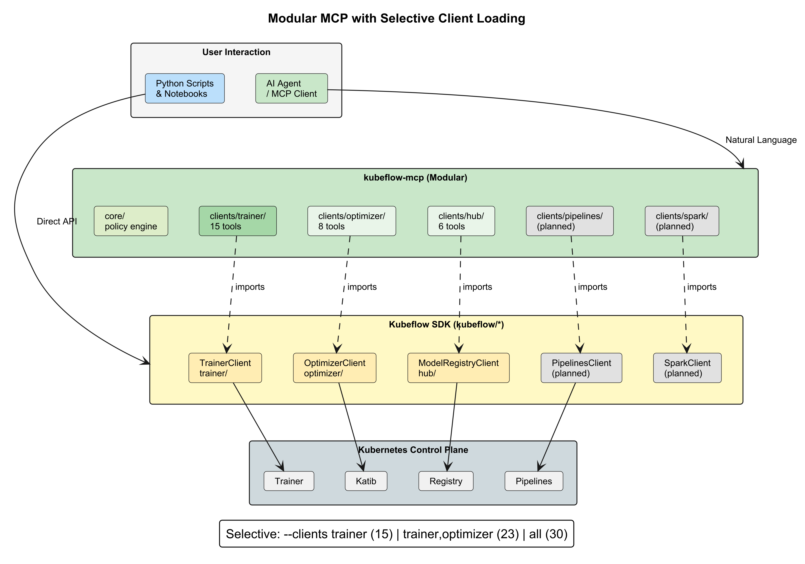

The release versioning is now calendar-based (Year.Month.Patch). Around two base releases are [planned](https://github.com/kubeflow/manifests/blob/master/releases/kubeflow-ai-reference-platform-release-handbook.md) per year with optional patch releases. The [best-effort only community support](https://www.kubeflow.org/docs/started/support/#support-from-the-kubeflow-community) is roughly 6 months and there is [commercial support](https://www.kubeflow.org/docs/started/support/#support-from-commercial-providers-in-the-kubeflow-ecosystem) available from multiple vendors. Please update regularly as explained in our [upgrading and extending section](https://github.com/kubeflow/community-distribution?tab=readme-ov-file#upgrading-and-extending) to benefit also from security and performance improvements.
Release details: [26.03](https://github.com/kubeflow/community-distribution/releases/tag/26.03) and [26.03.1](https://github.com/kubeflow/community-distribution/releases/tag/26.03.1).

## Highlight features 26.03

* Kubernetes 1.35+
* Kubeflow Pipelines 2.16.0, Spark operator 2.5.0 Model registry v0.3.7, Kserve Web Application v0.16.0
* Compatibility of Kubeflow Pipelines v1 and v2 with PSS restricted
* Extended KServe tests with authentication and authorization from inside and outside the cluster as well as non-knative / raw deployments
* Simplified installation and automatic installation of the right Kustomize and Kubectl versions
* Installation steps tested and based on our CI, easier in-place updates (optimized PDBs)
* Cleanup of all synchronization steps for faster releases / updates of dependencies
* Knative 1.20, cert-manager 1.19.4, oauth2-proxy v7.14.3, Dex 2.45.0
* Fix network policies for cert-manager, knative-serving, istio-system, dex, oauth2-proxy

## Highlight features 26.03.1

- Kind 0.32+ and Kubernetes 1.36 CI tests
- Kubeflow Pipelines 2.16.1, Spark operator 2.5.0 Model Registry v0.3.9, KServe Web Application v0.18.0
- Trainer 2.2.0
- Kserve 0.18.0
- Kubeflow/notebooks v1 update and workspaces (v2) beta
- Kubeflow/dashboard v2
- Enable model registry, catalog, and UI in default Kubeflow installation
- Complete renaming of Model Registry to Kubeflow Hub, capturing the project's broader scope
- Kubeflow Hub: Prepare for v1 release by ensuring stable API
- Knative 1.22.0, cert-manager 1.20.2, oauth2-proxy v7.15.2, Dex 2.45.1
- Istio 1.30.1 with hostUsers: false support
- CI, PSS restricted and network policies for the optional knative-eventing
- Restructure Upgrading section with version-specific upgrade notes

## Kubeflow Community Distribution:

* [Documentation updates](https://github.com/kubeflow/community-distribution/blob/master/README.md) that make it easier to install, extend and upgrade Kubeflow

### Kubeflow Community Distribution 26.03

|Notebooks|Dashboard|Pipelines|Katib|Trainer|KServe|Model Registry|Spark|SDK|
| :------------------------------------------------------: | :---------------------------------------: | :--------------------------------------------------------: | :---------------------------------------: | :--------------------------------------------------------: | :---------------------------------------: | :--------------------------------------------------------: | :---------------------------------------: | :--------------------------------------------------------: |
| [1.10.0](https://github.com/kubeflow/kubeflow/releases/tag/v1.10.0) | [1.10.0](https://github.com/kubeflow/kubeflow/releases/tag/v1.10.0) | [2.16.0](https://github.com/kubeflow/pipelines/releases/tag/2.16.0) | [0.19.0](https://github.com/kubeflow/katib/releases/tag/v0.19.0) | [2.1.0](https://github.com/kubeflow/trainer/releases/tag/v2.1.0) | [0.16.0](https://github.com/kserve/kserve/releases/tag/v0.16.0) | [0.3.7](https://github.com/kubeflow/model-registry/releases/tag/v0.3.7) | [2.5.0](https://github.com/kubeflow/spark-operator/releases/tag/v2.5.0) | [0.3.0](https://github.com/kubeflow/sdk/releases/tag/0.3.0) |

|Kubernetes|Argo|Kustomize|Cert Manager|Knative|Istio|Dex|OAuth2-proxy|
| :--------: | :----: | :-------: | :----------: | :-----: | :----: | :----: | :----------: |
|  [1.35+](https://github.com/kubernetes/kubernetes/releases/tag/v1.35.3)  | [3.7.3](https://github.com/argoproj/argo-workflows/releases/tag/v3.7.3) |  [5.8.1](https://github.com/kubernetes-sigs/kustomize/releases/tag/kustomize%2Fv5.8.1) |  [1.19.4](https://github.com/cert-manager/cert-manager/releases/tag/v1.19.4)   |   [1.21.0](https://knative.dev/blog/releases/announcing-knative-v1-21-release/) |  [1.29.0](https://github.com/istio/istio/releases/tag/1.29.0) | [2.45.0](https://github.com/dexidp/dex/releases/tag/v2.45.0) |  [7.14.3](https://github.com/oauth2-proxy/oauth2-proxy/releases/tag/v7.14.3) |

### Kubeflow Community Distribution 26.03.1

|Notebooks|Dashboard|Pipelines|Katib|Trainer|KServe|Hub|Spark|
| :------------------------------------------------------: | :---------------------------------------: | :--------------------------------------------------------: | :---------------------------------------: | :--------------------------------------------------------: | :---------------------------------------: | :--------------------------------------------------------: | :---------------------------------------: |
| [1.11 / 2.0-alpha.3](https://github.com/kubeflow/notebooks/releases/tag/v1.11.0) | [2.0](https://github.com/kubeflow/dashboard/releases#release-v2.0.0) | [2.16.1](https://github.com/kubeflow/pipelines/releases/tag/2.16.1) | [0.19.0](https://github.com/kubeflow/katib/releases/tag/v0.19.0) | [2.2.0](https://github.com/kubeflow/trainer/releases/tag/v2.2.0) | [0.18.0](https://github.com/kserve/kserve/releases/tag/v0.18.0) | [0.3.9](https://github.com/kubeflow/hub/releases/tag/v0.3.9) | [2.5.0](https://github.com/kubeflow/spark-operator/releases/tag/v2.5.0) |

|Kubernetes|Argo|Kustomize|Cert Manager|Knative|Istio|Dex|OAuth2-proxy|
| :--------: | :----: | :-------: | :----------: | :-----: | :----: | :----: | :----------: |
|  [1.35+](https://github.com/kubernetes/kubernetes/releases/tag/v1.35.3)  | [3.7.3](https://github.com/argoproj/argo-workflows/releases/tag/v3.7.3) |  [5.8.1](https://github.com/kubernetes-sigs/kustomize/releases/tag/kustomize%2Fv5.8.1) |  [1.20.2](https://github.com/cert-manager/cert-manager/releases/tag/v1.20.2)   |   [1.22.0](https://knative.dev/blog/releases/announcing-knative-v1-22-release/) |  [1.30.1](https://github.com/istio/istio/releases/tag/1.30.1) | [2.45.1](https://github.com/dexidp/dex/releases/tag/v2.45.1) |  [7.15.2](https://github.com/oauth2-proxy/oauth2-proxy/releases/tag/v7.15.2) |

## [Pipelines](https://github.com/kubeflow/pipelines)

- Complete MinIO deprecation has been implemented.
- SeaweedFS storage support has been added in 2.15.0.
- AWS SDK v2 now replaces the MinIO client code.
- Native OIDC support has been added.
- Control flows supporting conditional evaluation and parallel execution have been added to Local Runner.
- These features can run on your local machine.
- Increased capacity limits include:
  - The pipeline input size limit has been doubled to 20KB.
  - The gRPC message size limit for MLMD has been increased to 100MB.

## [Model Registry → Hub](https://github.com/kubeflow/hub)

- Model Registry has been renamed to Hub
  - Product has evolved beyond a registry with the inclusion of Model Catalog and MCP Catalog
- MCP Catalog is now integrated into the Hub
  - Search, browse, & deploy MCP servers
  - Tool listing and management of MCP servers now available with details view, sidebar navigation, and search/filtering
- Model Catalog enhancements:
  - Performance benchmarking & hardware comparisons (Pareto filtering, latency sorting, and more)
  - Pull models directly from Hugging Face into the catalog
  - Advanced search and filtering capabilities
- OCI is now the standard for model storage

## [Training Operator (Trainer)](https://github.com/kubeflow/trainer)

- **New Features:**
  * XGBoost & JAX Runtimes
  * Flux Runtime for MPI and HPC Workloads
  *  TrainJob Lifecycle

- **Breaking Changes:**
  * Replace PodTemplateOverrides with RuntimePatches API
  * Remove numProcPerNode from Torch API
  * Remove ElasticPolicy API
  * Fix immutability of the TrainJob APIs

## [Katib](https://github.com/kubeflow/katib)

- **Kubernetes-native AutoML:** Seamlessly run automated machine learning workflows on Kubernetes using Katib.
- **Trainer integration:** Integrates with the Kubeflow Trainer API, making it easy to launch and manage training jobs.
- **Hyperparameter tuning with TrainJob:** Run hyperparameter tuning experiments using the `TrainJob` API for a streamlined training and optimization workflow.
- **Kubeflow SDK support:** Use the Kubeflow SDK client to programmatically create, manage, and monitor Katib experiments.

## [Spark Operator](https://github.com/kubeflow/spark-operator)

- **Feature gates:** Enable safe rollout and testing of new capabilities without impacting production workloads.
- **Namespace label-based watching:** Simplifies multi-tenant deployments by automatically discovering Spark namespaces.
- **PartialRestart:** Reduces job disruption by restarting only affected components instead of the entire application.
- **Spark Connect validation:** Catches configuration issues earlier, reducing failed submissions.
- **Structured logging:** Makes troubleshooting and observability easier for platform operators.
- **Spark 4.0.1 support:** Enables adoption of the latest Spark features and ecosystem improvements.

### Spark Operator Community

We have a new name for our bi-weekly calls: “Spark on Kubernetes”!

- Meeting times: Bi-weekly on Friday @ 9:00 AM PST
- [Linux Foundation zoom link](https://zoom-lfx.platform.linuxfoundation.org/meeting/91692004209?password=e48ce50b-b41d-459a-9f32-7313fa388380)
- Join #kubeflow-spark-on-kubernetes Slack channel

## [KServe](https://github.com/kserve/kserve)

- Standardized GenAI inference
  - Introduced the LLMInferenceService CRD to make LLM serving a first-class, opinionated platform primitive instead of raw vendor-specific configurations
- Multinode LLM workloads & Production grade LLM autoscaling
  - 0.18 laid groundwork for distributed inference across multiple nodes without forcing Ray, using KServe own scheduler/LWS integration
  - Added Workload Verification Authority (WVA) + KEDA/HPA integration so LLM endpoints scale based on real inference demand, not just CPU/memory
- OpenAI-compatible APIs expanded
  - Added /v1/responses route for OpenAI Responses API; standardized REST/gRPC dual-protocol routing for Standard mode
- Model cache matured
  - Namespace-scoped ModelCache support plus configurable download job scheduling, reducing cold-start latency for shared models

## [Dashboard](https://github.com/kubeflow/dashboard) and [Notebooks](https://github.com/kubeflow/notebooks)

- **Manifest restructuring:** The Dashboard manifests have undergone breaking changes. If you're upgrading, be sure to review the migration guide included in the [release notes](https://github.com/kubeflow/dashboard/releases/tag/v2.0.0) and the [community distribution documentation](https://github.com/kubeflow/community-distribution/#2603---next-release).
- **New release milestone:** This is the first release published from the new `kubeflow/dashboard` and `kubeflow/notebooks` repositories.
- **Maintenance updates:** All Notebook and Workspace images have been refreshed with important security updates and fixes.
- **End-of-Life (EOL) notice:** The Notebooks v1 components will reach End of Life (EOL) at the end of the year. They are now in maintenance mode and will receive only bug fixes and critical updates.
- **Learn more:** For a complete list of changes, enhancements, and migration guidance, refer to the Notebooks v1 and Dashboard release notes.

###  Notebooks 2.0.0-alpha

- **Testing manifests available:** Manifests for **2.0.0-alpha.3** are available for testing in **Kubeflow 26.03.1**. These are intended for evaluation only and are **not yet ready for production use**.
- **Project progress:** Development is in full swing, and the project is on a strong path toward General Availability (GA).
- **Contributing made easy:** A complete development environment can now be set up with a single command, making it easier than ever to contribute.
- **Key improvements over Notebooks v1:**
  - Edit existing Workspaces.
  - A more intuitive, data scientist–focused user experience.
  - SSH access to Workspaces *(upcoming, currently available as a proof of concept)*.
  - Enhanced activity probe ("culling") capabilities.
  - Image redirects for cluster administrators.
- **Get involved:** Join the **#kubeflow-notebooks** Slack channel or attend one of the community meetings to learn more and contribute.

## What's New 

### Kubeflow MCP 

- Join #kubeflow-ml-experience Slack channel
- [Git Repo](https://github.com/kubeflow/community/pull/937)

### Kale: Kubeflow Automated Pipelines Engine

- **Notebook-to-Pipeline Conversion:** Seamlessly transforms annotated Jupyter notebooks into Kubeflow Pipelines without changing existing code.
- **JupyterLab Integration:** Runs entirely inside the JupyterLab UI, enabling users to define, run, and monitor Kubeflow Pipelines from their IDE.
- **Visual Pipeline Authoring:** Provides an intuitive UI for defining pipeline steps, dependencies, and parameters directly within notebooks.
- Kale 2.0 Roadmap: https://github.com/kubeflow/kale/issues/457 

## How to get started with 26.03

Visit the community distribution [release page](https://github.com/kubeflow/community-distribution/releases) or head over to the Getting Started and Support pages.

## Join the Community

We would like to thank everyone who contributed to Kubeflow 26.03, and especially Tarek Abouzeid for his work as the v26.03 Release Manager. We also extend our thanks to the entire release team and the working group leads, who continuously and generously dedicate their time and expertise to Kubeflow.

Release team members : Tarek Abouzeid, Dominik Kawka, Dhanisha Phadate, Milind Dethe, Alok Dangre, Anya Kramar, Andy Stoneberg, Alyssa Goins, Matteo Mortari, Adysen Rothman, Milos Grubjesic, Vraj Bhatt

Working Group leads : Andrey Velichkevich, Julius von Kohout, Chase Christensen, Mathew Wicks, Francisco Arceo

Kubeflow Steering Committee : Andrey Velichkevich, Chase Christensen, Francisco Arceo, Julius von Kohout, Mathew Wicks

You can find more details about Kubeflow distributions
[here](https://www.kubeflow.org/docs/started/installing-kubeflow/#packaged-distributions).

## Want to help?

The Kubeflow community Working Groups hold open meetings and are always looking for more volunteers and users to unlock
the potential of machine learning. If you’re interested in becoming a Kubeflow contributor, please feel free to check
out the resources below. We look forward to working with you!

* Visit our [Kubeflow website](https://www.kubeflow.org/docs/about/community/) or Kubeflow GitHub Page.
* Join the [Kubeflow Slack channel](https://www.kubeflow.org/docs/about/community/).
* Join the [kubeflow-discuss](https://groups.google.com/g/kubeflow-discuss) mailing list.
* Attend our weekly [community meeting](https://www.kubeflow.org/docs/about/community/#kubeflow-community-call).
